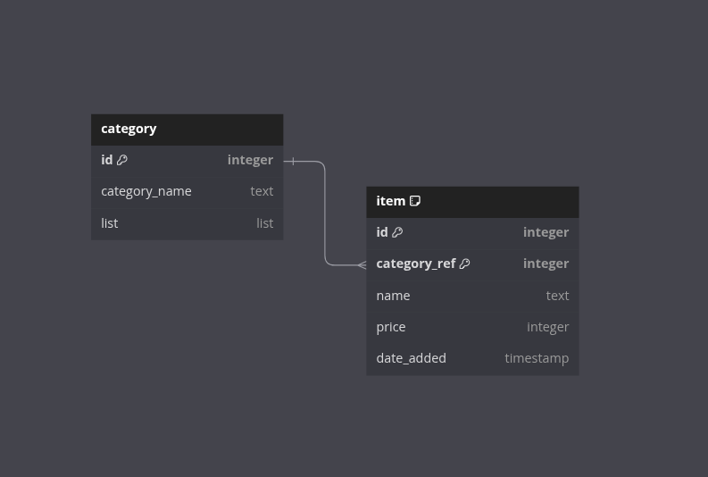
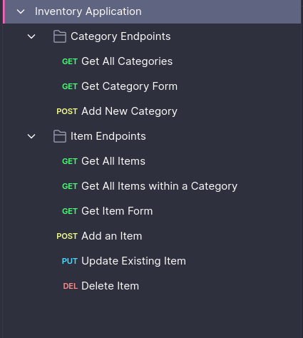

# Inventory Application

The theme of this application is to store games. This can range from board games, puzzle games, to different types of video games.
Individuals can perform CRUD operations to add, update or delete entries. While authorization was not implemented I did add a secret key that needs to be given when deleting items.

## Stack

Built with an `Express` backend, `EJS` templating language, `Postgresql` for the database, and `Tailwind` for styling.
Form validation utilize the powerful `express-validator` module.

### Learning Points

- How to utilize query operations to grab specific data needs.
- More practice with form validation and sanitization to ensure data being received is valid.
- Database Table design to ensure I have a solid plan before any code was ever written.
- API design (While this was not covered I tried to go for a RESTful API structure) ensuring I had a bulk of the endpoints I would need before any code was written.

Application is hosted on `Render`: [Inventory Application]("/")

## Database Table Design

## API Endpoints

